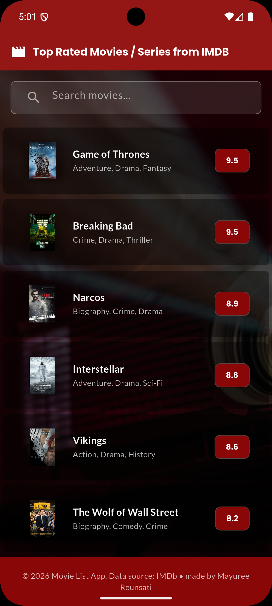
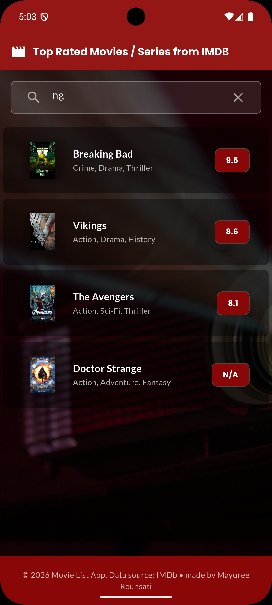

# Movie List App
Movie detail screen with image slider and search functionality

## 🎬 Features
- Top-rated movies/series from IMDb JSON data

- Live search by movie title (SQL ILIKE '%vatar%' → finds "Avatar")

- Image slider with dot indicators (swipe fixed for web/mobile)

- Responsive design - works on Android, iOS, Web (Chrome)

- Dark cinema theme with custom red accent (#890707)

- Smooth animations and Material Design cards

- Proper state management with FutureBuilder + TextEditingController

## 🚀 Quick Start
#### Prerequisites
- Flutter 3.0+ (flutter doctor)

- Assets folder with `movies.json` and `cinema_bg.jpg`

#### Installation
````
git clone https://github.com/mareerray/movie-list.git

cd movie-list

flutter pub get
````

#### Run
````
// Android/iOS

flutter run

// Web (Chrome)

flutter run -d chrome
````
#### Build the App
For Android:
```dart
flutter build apk --release
```
The APK file will be created at:
```dart
build/app/outputs/flutter-apk/app-release.apk
````

## 📱 Screenshots

| Home Screen | Movie Details | Search |
|-------------|---------------|--------|
|  |  |  |


## 🛠 Technical Highlights

####  Search (SQL ILIKE Equivalent)
```dart
movie.title.toLowerCase().contains(query)
// "avatar".contains("vatar") = true ✅
```

#### Key Components

````
lib/
├── models/movie.dart          # Movie data model
├── services/movie_service.dart # JSON parsing + sorting by IMDb rating
├── screens/
│   ├── home_screen.dart       # FutureBuilder + live search
│   └── movie_detail_screen.dart # PageView slider + PopScope
└── assets/movies.json         # IMDb top-rated data
````

#### Web Fixes Applied
- PopScope(canPop: true) - prevents swipe-back conflicts

- web/index.html CSS - blocks browser back overscroll


## 📝 Technical Requirements Met

✅ Image slider with swipe navigation (web/mobile fixed)

✅ Search by title with substring matching (case-insensitive)

✅ Detail screen with movie info cards

✅ Responsive backgrounds (no white space)

✅ Proper memory management (dispose())

✅ Sorted by IMDb rating (descending : hight to low)


## Data source: 
IMDb JSON dataset


## Author
[Mayuree Reunsati](https://github.com/mareerray)